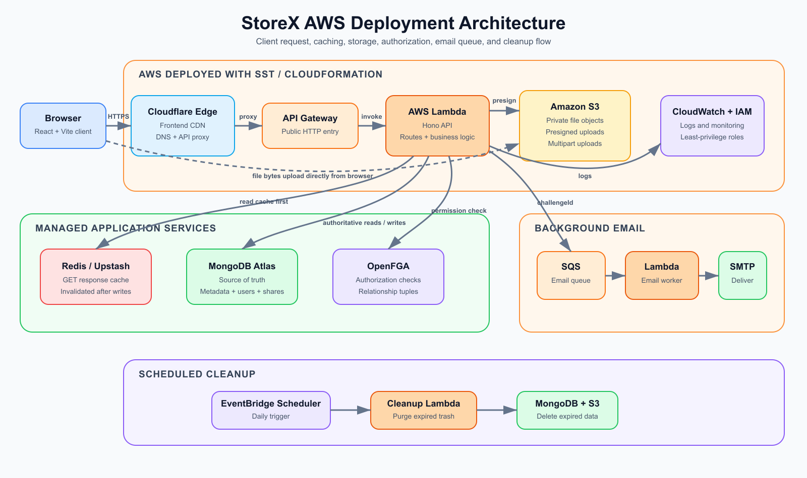

# StoreX

StoreX is a full-stack cloud storage platform for securely uploading, organizing, sharing, and managing files and folders. It combines a React dashboard with a Hono API, fine-grained authorization, Redis caching, subscription billing, and an event-driven AWS deployment.

## AWS Deployment Architecture



The client is delivered through the AWS static-site/CDN layer. API requests pass through Amazon API Gateway to the Hono application running on AWS Lambda. The API uses Redis for cached reads, MongoDB as the source of truth, Amazon S3 for file objects, OpenFGA for authorization, Stripe for billing, and Amazon SQS for asynchronous signup-email delivery. Scheduled trash cleanup runs independently through an AWS cron-triggered Lambda function.

## Features

### Authentication and accounts

- Email and password signup and signin
- JWT-based authenticated sessions
- Email verification using one-time passwords
- Forgot-password and reset-password flows
- Google and GitHub OAuth signin
- Secure logout and current-user session checks

### File and folder management

- Upload and save files in Amazon S3
- Multipart uploads with start, presign, complete, and abort operations
- Create nested folders and browse folder contents
- Rename and delete files and folders
- Search files and folders
- Recent-items history
- Trash with item restoration
- Automated daily trash cleanup in production

### Sharing and authorization

- Share files and folders with other users
- Search users and send sharing invitations
- Dedicated “Shared with me” view
- Inspect existing shares for an item
- Fine-grained read, create, delete, and share permissions
- Parent-child permission inheritance through OpenFGA

### Performance and storage

- Redis caching for file and folder listings
- Pattern-based cache invalidation after mutations
- MongoDB remains authoritative when cached data is unavailable
- Per-user storage allocation and usage tracking
- Atomic quota reservation to prevent concurrent uploads from exceeding limits
- Usage breakdown for documents, media, and other files

### Billing

- Free, Pro, and Ultra storage plans
- Stripe Checkout for plan upgrades
- Stripe Customer Portal for subscription management
- Webhook-driven subscription synchronization

### Messaging and reliability

- Signup emails processed asynchronously through Amazon SQS
- Lambda-based email queue consumer
- Dead-letter queue with retry handling for failed messages
- Centralized API error handling and CORS configuration
- Health endpoint for deployment monitoring

### Dashboard experience

- Responsive React dashboard built with TypeScript
- File and folder navigation views
- Storage usage and subscription information
- Reusable interface components with Tailwind CSS and Radix UI
- Server-state caching and synchronization with TanStack Query
- Animated interactions using Framer Motion

## Technology Stack

| Layer | Technologies |
| --- | --- |
| Frontend | React 19, TypeScript, Vite, Tailwind CSS, TanStack Query, Radix UI |
| API | Hono, Node.js, TypeScript, Zod |
| Data | MongoDB, Mongoose, Redis |
| Storage | Amazon S3, presigned URLs, multipart uploads |
| Authorization | OpenFGA |
| Billing | Stripe |
| Messaging | Amazon SQS and dead-letter queue |
| AWS deployment | SST, CloudFront/static hosting, API Gateway, Lambda, S3, SQS, scheduled functions, CloudWatch |
| Tooling | pnpm workspaces, Turborepo, TypeScript |

## Repository Structure

```text
apps/
  api/                    Hono API, controllers, routes, models, jobs, and workers
  ui/                     React dashboard
packages/
  clients/                Redis, S3, Stripe, and OpenFGA clients
  env/                    Shared environment configuration
  httpUtils/              Shared HTTP helpers
services/
  cacheServices/          Redis cache wrappers and invalidation
  emailServices/          Email templates and delivery service
  multiPartUploadServices/ Multipart-upload helpers
sst.config.ts             AWS infrastructure definition
```

## Local Development

Install dependencies and start the workspace:

```bash
pnpm install
pnpm dev
```

The API reads local configuration from `.env.local`. Configure MongoDB, Redis, AWS/S3, OpenFGA, OAuth, SMTP, and Stripe values before starting services that depend on them.

## AWS Deployment

Deploy the application with SST after configuring the required SST secrets and AWS profile:

```bash
pnpm sst:deploy
```

SST provisions the static web application, API Gateway, Lambda functions, S3 upload bucket, signup-email queue and dead-letter queue, scheduled trash cleanup, and associated runtime configuration.
